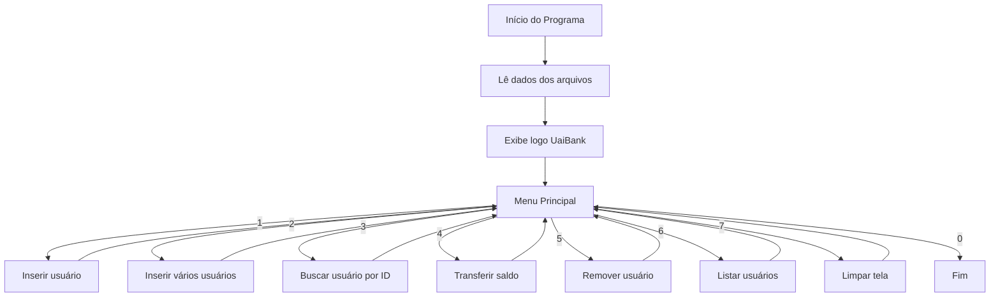

# UaiBank

Sistema bancário simples em C para cadastro, consulta, remoção, listagem e transferência de saldo entre usuários, com persistência em arquivos de texto.

---

## Sumário

- [Descrição Geral](#descrição-geral)
- [Tecnologias Utilizadas](#tecnologias-utilizadas)
- [Como Funciona](#como-funciona)
- [Fluxograma do Sistema](#fluxograma-do-sistema)
- [Estrutura dos Dados](#estrutura-dos-dados)
- [Funcionalidades](#funcionalidades)
- [Interação com o Usuário](#interação-com-o-usuário)
- [Exemplo de Uso](#exemplo-de-uso)

---

## Descrição Geral

O **UaiBank** é um sistema de terminal que permite gerenciar usuários bancários, realizando operações como cadastro, busca, remoção, listagem e transferência de saldo. Os dados são armazenados nos arquivos `dados.txt` (informações dos usuários) e `log.txt` (IDs dos usuários), garantindo persistência entre execuções.

---

## Tecnologias Utilizadas

| Tecnologia/Biblioteca | Onde é utilizada                | Função principal                                  |
|-----------------------|---------------------------------|---------------------------------------------------|
| `stdio.h`             | Todo o código                   | Entrada/saída padrão (printf, scanf, fgets, etc.) |
| `stdlib.h`            | Alocação dinâmica, conversões   | malloc, realloc, atoi, atof                       |
| `string.h`            | Manipulação de strings          | strlen, strcpy, strchr, etc.                      |
| `unistd.h`            | Animação do logo                | usleep para pausar a exibição do texto            |
| Sistema de arquivos   | Funções de leitura/escrita      | Persistência dos dados dos usuários               |

---

## Como Funciona

- **Persistência:** Os dados dos usuários são salvos em arquivos de texto (`dados.txt` e `log.txt`).
- **Menu interativo:** O usuário interage via terminal, escolhendo opções numéricas.
- **Validação:** Entradas são validadas para evitar dados inválidos.
- **Operações:** Cadastro, busca, remoção, listagem e transferência de saldo.

---

## Fluxograma do Sistema



---

## Estrutura dos Dados

```c
typedef struct {
    int id;
    char nome[101];
    int idade;
    float saldo;
} Usuarios;
```

---

## Funcionalidades

| Função                    | Responsabilidade principal                                  |
|---------------------------|------------------------------------------------------------|
| `main`                    | Fluxo principal, menu e controle do sistema                |
| `escrever_uai_bank`       | Exibe o logo animado                                       |
| `ler_inteiro`/`ler_float` | Lê e valida entradas numéricas                             |
| `novo_usuario`            | Cadastro de novo usuário                                   |
| `atualizar_arquivo`       | Salva novo usuário nos arquivos                            |
| `ler_arquivo`             | Carrega usuários dos arquivos                              |
| `buscar_id`               | Busca usuário pelo ID                                      |
| `deletar_usuario`         | Remove usuário pelo ID                                     |
| `reescrever_arquivo`      | Atualiza arquivos após remoção/transferência               |
| `realizar_transferencia`  | Transfere saldo entre usuários                             |

---

## Interação com o Usuário

O usuário interage via terminal, escolhendo opções do menu principal:

```
======== UaiBank ========
1 - Inserir usuario
2 - Inserir varios usuarios
3 - Buscar usuario por ID
4 - Realizar transferencia
5 - Remover usuario por ID
6 - Listar usuarios
7 - Limpar Tela
0 - Sair
=========================
Escolha uma opcao:
```

Cada operação solicita os dados necessários, valida as entradas e informa o sucesso ou erro das operações.

---

## Exemplo de Uso

1. **Cadastrar usuário:**  
   Escolha a opção 1, informe nome, idade e saldo inicial.

2. **Buscar usuário:**  
   Opção 3, informe o ID.

3. **Transferir saldo:**  
   Opção 4, informe ID de origem, ID de destino e valor.

4. **Remover usuário:**  
   Opção 5, informe o ID.

5. **Listar usuários:**  
   Opção 6.

---


---

